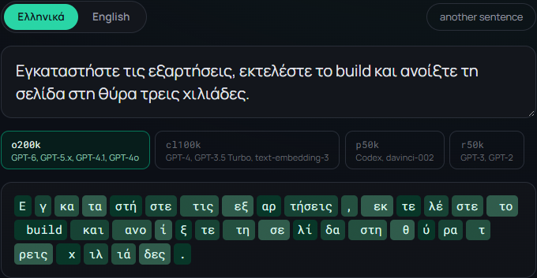
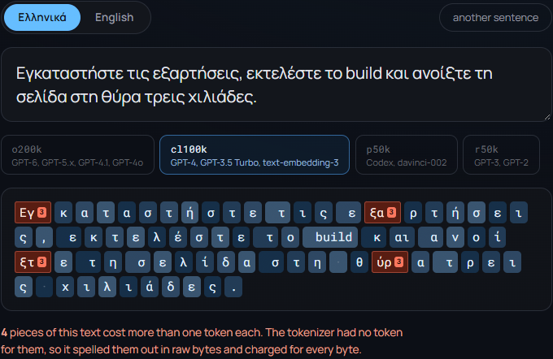

# tokenlab

**Greek costs 2.09 times the tokens of English on the newest OpenAI vocabulary,
and 5.14 times on the one before it.** Measured here, on forty aligned sentence
pairs, with the interval printed next to it.

Type Greek into the page and watch a tokenizer take it apart. Switch the
encoding and watch the same sentence go from words to single letters to raw
bytes, with the bill updating as it happens.

| the same sentence on `o200k` | the same sentence on `cl100k` |
|---|---|
|  |  |

Every Greek letter on the right is its own token. The English word `build` in
the middle of it is one token. That is the whole finding in one picture.

## The numbers

Forty sentence pairs, written by hand in both languages across five registers,
committed in [`data/pairs.json`](data/pairs.json). Ratios are totals over
totals, not a mean of per sentence ratios. Intervals are a paired bootstrap,
10,000 resamples, fixed seed.

| encoding | used by | Greek costs | 95% interval | tokens per Greek word |
|---|---|---|---|---|
| `o200k_base` | GPT-6, GPT-5.x, GPT-4.1, GPT-4o | **2.09x** | 1.97 to 2.20 | 2.43 against 1.12 in English |
| `cl100k_base` | GPT-4, GPT-3.5 Turbo, text-embedding-3 | **5.14x** | 4.81 to 5.47 | 5.99 against 1.13 in English |
| `p50k_base` | Codex, davinci-002 | **6.48x** | 6.07 to 6.87 | 7.60 against 1.13 in English |
| `r50k_base` | GPT-3, GPT-2 | **6.48x** | 6.07 to 6.87 | 7.60 against 1.13 in English |

Reproduce all of it:

```bash
npm install
npm run measure
```

That writes `src/generated/findings.json`, which is the only thing the page
reads. No number in this repository is typed by hand, with one exception:
prices live in [`data/pricing.json`](data/pricing.json) and carry the date they
were checked and the page they came from.

## What the numbers say

The o200k vocabulary cut the Greek penalty by 2.46 times against cl100k. That
is a real improvement and it is not widely known. It also means every cost model
built on a GPT-4 era tokenizer overstates Greek by roughly two and a half times,
and every cost model built before that overstates it by three.

The penalty is not uniform. On `o200k` it runs from 1.58x on everyday
conversation to 2.33x on technical writing, and on `cl100k` from 3.55x to
5.79x across the same two registers. Everyday Greek is the cheapest thing you
can send, and the gap is wide enough that a cost estimate built on chat
transcripts will understate a technical workload by a third. The full per
register breakdown is in `src/generated/findings.json`.

## Run it

```bash
npm install
npm run dev      # http://localhost:5173
npm run build    # static files in dist/, deploys to any static host
```

No backend, no API key, no network at runtime. The vocabularies are loaded
lazily, one per encoding, so the page paints before the 2 MB o200k vocabulary
arrives.

## How it works

- `src/lib/tokenizers.ts` the encoding registry, one lazy import per encoding.
- `src/lib/segment.ts` turns token ids into things you can look at. The
  interesting case: when a tokenizer has no token for a character it emits the
  raw UTF-8 bytes, so one character becomes several tokens and none of them
  decodes to anything on its own. Those are the red chips.
- `tools/measure.ts` the measurement, run by `npm run measure`.
- `data/pairs.json` the corpus, forty pairs, CC0.

## The honest limits

- Forty pairs is a small corpus. That is why the interval is shown and why the
  ratio is never quoted without it.
- The pairs are written by one bilingual author. A different author would write
  different Greek and the ratio would move, probably by less than the interval
  but that is an assumption, not a measurement.
- Only the four tiktoken encodings are covered. Llama, Gemma and Qwen use
  SentencePiece vocabularies that are not here yet, and Greek behaves
  differently on each.

## Licence

Code MIT. Corpus CC0. Fonts are Manrope and Roboto Mono, both SIL Open Font
License, subset to Latin, Greek and punctuation, licences in `public/fonts/`.
