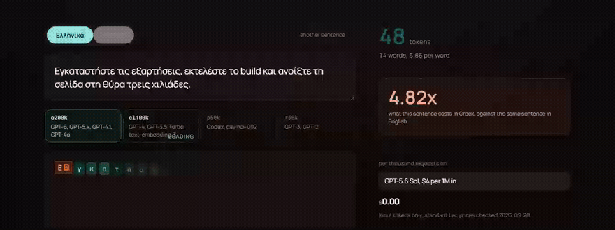

# tokenlab

**Greek costs 2.09 times the tokens of English on the newest OpenAI vocabulary.
Almost none of that is the tokenizer.** Greek is 2.015 times the UTF-8 bytes of
English before anything tokenizes it, and `o200k` adds 3.6 percent on top of
that. The same measurement on `cl100k` adds 155 percent, and on `p50k` and
`r50k` it adds 221 percent.

That is the finding, and the first version of this README did not have it,
because a raw token ratio measures the writing system and the vocabulary at once
and hands the credit to the vocabulary.

Type Greek into the page and watch a tokenizer take it apart. Switch the
encoding and watch the same sentence go from word pieces to single letters to
raw bytes, with the bill updating as it happens.



That is the real page in a real browser, recorded by `npm run capture`. One
sentence, pinned so the recording can be checked: 82 tokens on `cl100k` and 37
on `o200k`. The price only appears once the selected encoding is the one the
chosen model actually uses, and a vocabulary that has not arrived yet says
loading rather than pretending to be selected.

The same thing standing still:

| `o200k`, 37 tokens for 14 Greek words | `cl100k`, 82 tokens for the same 94 characters |
|---|---|
|  |  |

The English word `build` sitting in the middle of that Greek sentence is one
token in both pictures. On the right, every Greek letter around it is its own.

## The numbers

Forty sentence pairs, written by hand in both languages across five registers,
committed in [`data/pairs.json`](data/pairs.json). Ratios are totals over
totals, not a mean of per sentence ratios. Intervals are a paired bootstrap,
10,000 resamples, fixed seed.

| encoding | used by | raw token ratio | 95% interval | bytes per token, Greek | vocabulary cost beyond the script |
|---|---|---|---|---|---|
| `o200k_base` | GPT-6, GPT-5.x, GPT-4.1, GPT-4o | 2.09x | 1.97 to 2.20 | 5.05 | **+3.6%** |
| `cl100k_base` | GPT-4, GPT-3.5 Turbo, text-embedding-3 | 5.14x | 4.81 to 5.47 | 2.05 | **+155%** |
| `p50k_base` | Codex, davinci-002 | 6.48x | 6.07 to 6.87 | 1.61 | **+221%** |
| `r50k_base` | GPT-3, GPT-2 | 6.48x | 6.07 to 6.87 | 1.61 | **+221%** |

English gets 5.23 bytes per token on `o200k` and 5.22 on `cl100k`, essentially
unchanged. Greek goes from 2.05 to 5.05 between the two. That is what the last
column is measuring: how many tokens the vocabulary spends per byte of Greek,
against how many it spends per byte of English.

`p50k` and `r50k` tokenize this corpus identically, to the token. They are
different vocabularies, but on this text they are one result, not two.

Reproduce all of it:

```bash
npm install
npm run measure   # writes src/generated/findings.json
npm run check     # asserts every number above against that file
```

The page reads `findings.json` directly. This README cannot, because it is
prose, so `npm run check` holds the two together: it rebuilds all 29 numeric
claims on this page from the measurement and fails by name if any of them has
drifted. It runs as part of `npm run build`, so the README cannot go stale
without the build going red.

It earned its place on its first run, by catching a bytes per token figure that
had been typed by hand as 1.63 when the measurement said 1.61.

Prices in [`data/pricing.json`](data/pricing.json) are the one set of numbers
not measured here, and they carry the date they were checked and the page they
came from.

## What the numbers say

`o200k` has effectively closed the Greek vocabulary gap. A 3.6 percent residual
is not something anyone should design around. What remains is the script: Greek
is two UTF-8 bytes a letter and English is one, and no vocabulary can undo that.

`cl100k` is the interesting one. There the vocabulary really does charge Greek
two and a half times per byte, which means any cost model built on a GPT-4 era
tokenizer overstates modern Greek by roughly two and a half times, and one built
before that overstates it by three.

The register spread is smaller than it looks. The raw ratio runs 1.58x to 2.33x
across registers on `o200k`, but most of that is the author writing the
conversational Greek 20 percent shorter than its English partner. Measured in
tokens per Greek word, which is what a Greek cost model actually uses, the spread
is 2.23 to 2.48, an 11 percent difference. On `cl100k` the same comparison is
5.00 to 6.50, a 30 percent difference, and that one is genuinely the tokenizer.

## Run it

```bash
npm install
npm run dev      # http://localhost:5173
npm run build    # static files in dist/, deploys to any static host
```

No backend and no API key. The page fetches its own JavaScript, fonts and
vocabularies from wherever it is hosted and then talks to nothing: no request
leaves for a third party, and your text never goes anywhere. The vocabularies are
loaded one per encoding on demand, so the page paints before the largest of them
arrives.

## How it works

- `src/lib/tokenizers.ts` the encoding registry, one lazy import per encoding.
- `src/lib/segment.ts` turns token ids into things you can look at. The
  interesting case: when a tokenizer has no token for a character it emits the
  raw UTF-8 bytes, so one character becomes several tokens and none of them
  decodes to anything on its own. Those are the red chips. Telling that apart
  from a replacement character that was genuinely in the input takes a
  re-encode, and getting it wrong swallows the rest of the document.
- `tools/measure.ts` the measurement, run by `npm run measure`.
- `data/pairs.json` the corpus, forty pairs, CC0.

## The honest limits

- Forty pairs is a small corpus. That is why the interval is shown and why the
  ratio is never quoted without it.
- The pairs are written by one bilingual author. A different author would write
  different Greek and the raw ratio would move. The byte controlled figure is
  much less sensitive to that, which is another reason to prefer it.
- Two of the eight formal pairs are taken from the Universal Declaration of
  Human Rights rather than written from scratch. It is public domain and it is
  aligned, but it is not what `data/pairs.json` says about itself, and that will
  be corrected.
- Only the four tiktoken encodings are covered. Llama, Gemma and Qwen use
  SentencePiece vocabularies that are not here yet, and Greek behaves
  differently on each.
- The corpus is NFC normalised. Greek written in NFD, which happens when text
  comes off some macOS pipelines, costs substantially more and is not measured
  here.

## Licence

Code MIT. Corpus CC0. Fonts are Manrope and Roboto Mono, both SIL Open Font
License, subset to Latin, Greek and punctuation, licences in `public/fonts/`.
